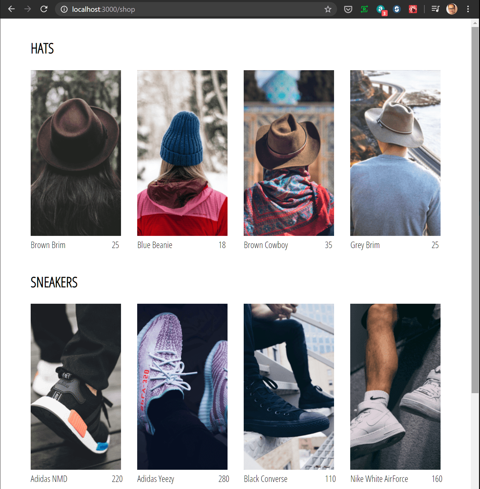
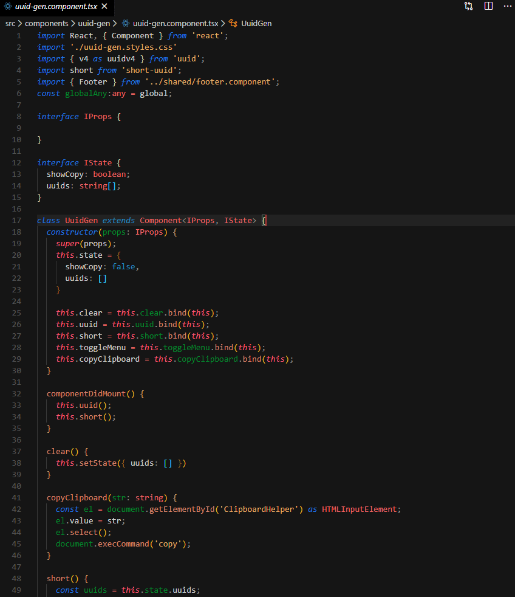
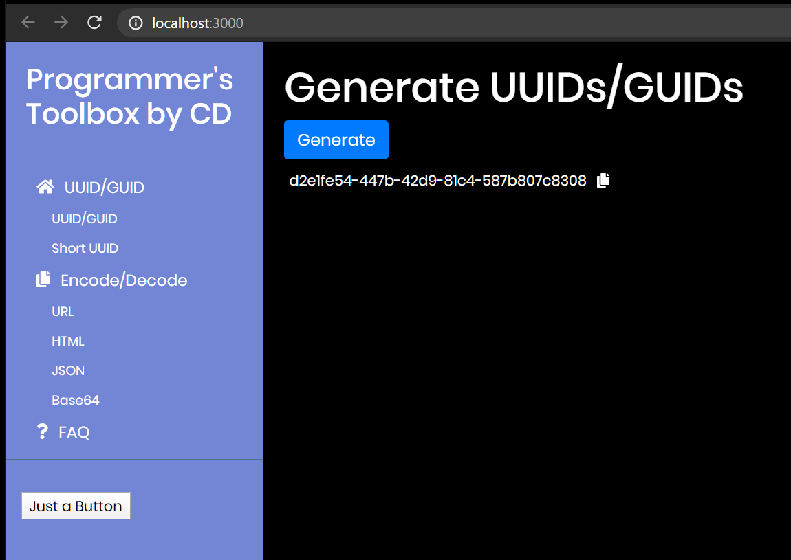
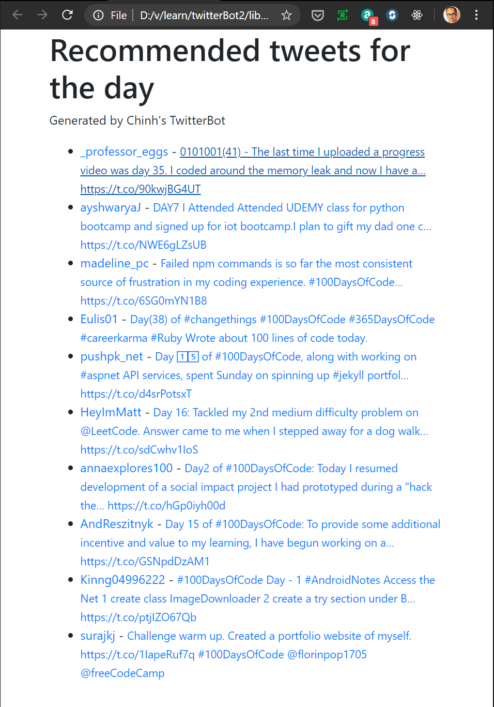

# 100 Days Of Code - [Chinh's Log](https://github.com/chinhdo)

## Day 57: Jul 14, 2020

**Today's Progress**

☑️Solved the #LeetCode "Longest Substring Without Repeating Characters" problem.
☑️Wrote some experimental code to test out Monaco editor https://microsoft.github.io/monaco-editor/ - I plan to use that code editor for my Programmers' Toolbox site

**Link to work:**

``` js
function lengthOfLongestSubstring(s: string): number {
 let longest = "";
  let curr = "";
  for (let i = 0; i < s.length; i++) {
    const ch = s[i];
    const p = curr.indexOf(ch);

    if (p < 0) {
      curr += ch;
      if (curr.length > longest.length) {
        longest = curr;
      }  
    }
    else {
      curr = curr.substr(p + 1) + ch;
    }

  }

  return longest.length;
};
```

## Day 56: Jul 12, 2020

**Today's Progress**

Break day yesterday. Spent an hour today on #LeetCode "Longest Substring Without Repeating Characters" without success - code still fails for some edge cases. Will continue tomorrow 😀

**Link to work:**

``` js
function lengthOfLongestSubstring(s: string): number {
  let longest = "";
  let curr = "";
  for (let i = 0; i < s.length; i++) {
    const p = curr.indexOf(s[i]);
    if (p < 0) {
      curr += s[i];
      if (curr.length > longest.length) {
        longest = curr;
      }  
    }
    else {
      console.log("[" + curr + "]");
      curr = curr.substr(p);
    }
  }

  console.log("Longest: [" + longest + "]");
  return longest.length;
};
```

## Day 55: Jul 10, 2020

**Today's Progress**

After a few tries I got the solution for #LeetCode "Add Two Numbers" working with TypeScript.

**Link to work:**

``` typescript
/**
 * Definition for singly-linked list.
 * class ListNode {
 *     val: number
 *     next: ListNode | null
 *     constructor(val?: number, next?: ListNode | null) {
 *         this.val = (val===undefined ? 0 : val)
 *         this.next = (next===undefined ? null : next)
 *     }
 * }
 */

function addTwoNumbers(l1: ListNode | null, l2: ListNode | null): ListNode | null {
  const ret = new ListNode();

  let n1 = l1;
  let n2 = l2;
  let n3 = ret;

  let carry = 0;
  do {
    n3.val = carry;
    carry = 0;

    if (n1) {
      n3.val += n1?.val;
      n1 = n1.next;
    }

    if (n2) {
      n3.val += n2.val;
      n2 = n2.next;
    }

    // carry
    if (n3.val >= 10) {
      n3.val = n3.val - 10;
      carry = 1;
    }

    if (!n1 && !n2) {
      break;
    }

    n3.next = new ListNode();
    n3 = n3.next;
  } while (true);

  if (carry > 0) {
    n3.next = new ListNode(carry);
  }
  console.log(JSON.stringify(ret));
  return ret;
};
```

## Day 54: Jul 9, 2020

**Today's Progress**

Worked on a couple of LeetCode problems & learned LeetCode UI:
* Two sum
* Add two numbers (almost working)

I like LeetCode a lot better than Project Euler. Problems seem to be more practical vs very math oriented.

**Link to work:**

``` typescript
function twoSum(nums: number[], target: number): number[] {
  const map: Map<number, number> = new Map<number, number>();
  for (let i=0; i<nums.length; i++) {
    map.set(nums[i], i);
  }

  console.log(map);

  for (let i=0; i<nums.length; i++) {
    const x = target - nums[i];
    
    if (map.has(x) && map.get(x) !== i) {
      console.log('X', map.get(x));
      return [i, map.get(x) || 0];
    }
  }
  
  return [0, 0];
};
```

## Day 53: Jul 8, 2020

**Today's Progress**

☑️Project Euler Problems 9  (Special Pythagorean triplet) & 10 (Summation of primes) - All this enhanced knowledge of prime numbers is going to be so handy at my job... not 😋
☑️Custom Strapi CMS controller
☑️Lifecycle hooks to log/audit Strapi changes

**Link to work:**

* [ProjectEuler](https://github.com/chinhdo/project-euler)
* [Strapi POC](https://github.com/chinhdo/strapi-cms-poc)


## Day 52: Jul 7, 2020

**Today's Progress**

Solved some more Project Euler's problems (problems 5-8). Favorite problem was the "10001st prime" problem. I think the code I came up with is close to the "Sieve of Eratosthenes" algorithm.

**Link to work:**

[GitHub](https://github.com/chinhdo/project-euler/blob/master/src/App.tsx)

## Day 51: Jul 6, 2020

**Today's Progress**

Break day yesterday.

[Installed](https://strapi.io/documentation/v3.x/deployment/azure.html) Strapi CMS with MongoDB on Azure. Configured Strapi auto-start with PM2.

Enabled GraphQL plugin. Testedf [GraphQL Playground](http://chinhdo2.eastus2.cloudapp.azure.com:1337/graphql).

Query to retrieve UI Component matching ComponentId:
```
query {
  uiComponents(
    limit:10
    where: { componentId: "test1" }
  ) {
    id componentId contentJson
  }
}
```

Retrieve multiple items:
```
query {
  uiComponents(
    limit:10
    where: { componentId_in: ["test1", "test2"] }
  ) {
    id componentId contentJson
  }
}
```

Tested [Auth API requests](https://strapi.io/documentation/3.0.0-beta.x/guides/auth-request.html#setup).

**Link to work:**

See notes above.

---

## Day 50: Jul 4, 2020

**Today's Progress**

I am 50% through the 100 Days of Code Challenge!

Spent an hour on solving a few ProjectEuler.net problems. They are pretty fun.

https://examples.chinhdo.com/project-euler.html

**Link to work:**

[Github](https://github.com/chinhdo/examples/blob/master/project-euler.html)

---
## Day 49: Jul 2, 2020

**Today's Progress**

Created a React Native Hello World app using Expo CLI & played around with SafeAreaView/ScrollView/Button, and styling.

**Link to work:**

[Github](https://github.com/chinhdo/react-native-hello)

---
## Day 48: Jul 1, 2020

**Today's Progress**

Took a break day yesterday - yes you are allowed to take a day off here and there, but only 1 day max at a time per the #100DaysOfCode rules Grinning face. 

Added support for copying directory to #dotnet Transactional File Manager library.

**Link to work:**

[Github](https://github.com/chinhdo/txFileManager/commit/84d58b361dc2f53ab395cb1271790ed762f046fb)

---
## Day 47: Jun 29, 2020

**Today's Progress**

I lost the code for the Processing animation I shared last night so I re-wrote it. Since I can't remember the exact parameters, it's not coming out quite the same. But I think it's still cool Grinning face

**Link to work:**

[Tweet](https://twitter.com/chinhdo/status/1277822002393427972)

---
## Day 46: Jun 27, 2020

**Today's Progress**

Worked some more on my #ARMA 3 custom mission. It's  fun to test this code but very time consuming.

**Link to work:**

[GitHub](https://github.com/chinhdo/arma-hunted/commit/74646232c8b82e4715ec18da702ab7f33bfc5fa6)

---
## Day 45: Jun 26, 2020

**Today's Progress**

Wrote Autohotkey script to switch windows and control volumn using my MIDI controller.

**Link to work:**

Will share later.

## Day 44: Jun 25, 2020

**Today's Progress**

Break day yesterday.

(I see that I accidentally skipped from Day 41 to 44 earlier... so I'm going back from 45 to 42 to adjust)

Worked on #dotnet Transactional File Manager library. About 1/3rd done with adding code to support copying directories.

**Link to work:**

[TxFileManager](https://github.com/chinhdo/txFileManager)

## Day 43: Jun 23, 2020

**Today's Progress**

Installed and configured Strapi (@strapijs) CMS on my Azure Ubuntu VM and played around with admin UI.

**Link to work:**

[Strapi](http://chinhdo2.eastus2.cloudapp.azure.com:1337)

## Day 42: Jun 22, 2020

**Today's Progress**

Playing around some more with Twitter API to build a graph of my tweets over time. According to this I started to tweet regularly around Mar 7 this year Grinning face

Tweets are written to a log file & fed to @Splunk, then a quick query to build this time chart

**Link to work:**

[Twitter-Bot](https://github.com/chinhdo/twitter-bot)

## Day 41: Jun 21, 2020

**Today's Progress**

Wrote a unix shell script to send bandwidth usage data from my Internet router running Tomato firmware to 
@Splunk HTTP Event Collector.

**Link to work:**

[Blog](https://t.co/Jir9Tu97NN?amp=1)

## Day 40: Jun 20, 2020

**Today's Progress**

Worked on a script to pull internet bandwidth usage data from my Netgear R7000 router running Advanced Tomato firmware to feed to #Splunk. Got most of it working. Still need to download the data to my home server/Splunk.

**Link to work:**

[GitHub](https://github.com/chinhdo/shell-scripts/blob/master/sh/bandwidth.sh)

---

## Day 39: Jun 19, 2020

**Today's Progress**

Worked on #dotnet Transactional File Manager library. Removed old branches. Misc refactors for better readability. Closed out a few issues.

**Link to work:**

[TxFileManager](https://github.com/chinhdo/txFileManager)

---

## Day 38: Jun 15, 2020

**Today's Progress**

The first language I fell in love with was c# Red heart

Did some work on TxFileManager #dotnet c# library. Processed an incoming PR. Added 
@github
 build triggers for pushes on any branches and PRs. Fixed bug with FileMove operation.

**Link to work:**

[TxFileManager](https://github.com/chinhdo/txFileManager)

---

## Day 37: Jun 17, 2020

**Today's Progress**

Worked on the Color Mixer for my #reactjs Programmers' Toolbox.

This turned out to be not so easy Winking face with tongue. Got code to convert HSL to RGB. Switched hue picker from div to canvas so I can "see" color value where mouse clicks.

**Link to work:**

[Programmer's Toolbox on Azure Static Web Apps](https://programmers-toolbox.chinhdo.com)
[GitHub](https://github.com/chinhdo/programmers-toolbox)

---

## Day 36: Jun 15, 2020

**Today's Progress**

Something different today: Max4Live visual programming. Created a "live sync" patch with buttons to skip to next,  current, prev 4 beats, etc.

For when I need to re-sync backing track to our live playing - with buttons mapped to MIDI controllersMusical keyboard.

**Link to work:**

Will need to figure out how to check Max4Live patches into GitHub.

---

## Day 35: Jun 14, 2020

**Today's Progress**

Started work on a color mixer and learn some more CSS & refreshed myself on RGB / HSV color models.

"user-select: none" fixed an intermittent issue with clicking/dragging on the Hue picker.

**Link to work:**

[Programmer's Toolbox on Azure Static Web Apps](https://programmers-toolbox.chinhdo.com)
[GitHub](https://github.com/chinhdo/programmers-toolbox)

---


## Day 34: Jun 13, 2020

**Today's Progress**

Having some fun today with a custom ARMA 3 mission "Hunted".

**Link to work:**

[arma-hunted](https://github.com/chinhdo/arma-hunted)

---

## Day 33: Fri Jun 12, 2020

**Today's Progress**

Worked on #reactjs Programmers' Toolbox. Fixed most remaining TypeScript eslint warnings. Added Lorem Ipsum generator.

**Link to work:**

[Programmer's Toolbox on Azure Static Web Apps](https://programmers-toolbox.chinhdo.com)
[GitHub](https://github.com/chinhdo/programmers-toolbox)

---

## Day 32: Thu Jun 11, 2020

**Today's Progress**

Created an animated logo for my Programmers' Toolbox #reactjs app. 

**Link to work:**

[Programmer's Toolbox on Azure Static Web Apps](https://programmers-toolbox.chinhdo.com)
[GitHub](https://github.com/chinhdo/programmers-toolbox)

---

## Day 31: Wed Jun 10, 2020

**Today's Progress**

Spent an hour on fixing various eslint warnings in my Programmers' Toolbox #react app. I understand why people say "sometimes TypeScript is not worth the troubles". It's certainly a lot of work. But I think in the long run it's worth it unless it's a throwaway app.

**Link to work:**

[Programmer's Toolbox on Azure Static Web Apps](https://programmers-toolbox.chinhdo.com)
[GitHub](https://github.com/chinhdo/programmers-toolbox)

---

## Day 30: Tue Jun 9, 2020

**Today's Progress**

Fixed several bugs with my JS/SVG/CSS watch. Added switch for sweeping vs stuttering second hand. Used window.requestAnimationFrame for optimal animation/smoothness and reduced CPU.

**Link to work:**

[Analog watch face with JS/SVG/CSS](https://examples.chinhdo.com/analog-clock.html)

---

## Day 29: Mon Jun 8, 2020

**Today's Progress**

Learned some SVG and created an analog watch face.

**Link to work:**

[Programmer's Toolbox on Azure Static Web Apps](https://programmers-toolbox.chinhdo.com)

---

## Day 28: Sun Jun 7, 2020

**Today's Progress**

Programmers' Toolbox: added Profile page, misc minor bug fixes on Encoding page. Enabled typeScript-eslint - that generated a ton more things I need to fix :)


**Link to work:**

[Programmer's Toolbox on Azure Static Web Apps](https://programmers-toolbox.chinhdo.com)

---

## Day 27: Sat Jun 6, 2020

**Today's Progress**

Took a break day yesterday (per the [100 Days of Code rules](https://www.100daysofcode.com/faq/) you are allowed to miss one day then make it up by adding one more day to the end of the 100, but never miss two days in a row.)

Today I spent a couple of hours working on a Node.js utility app to re-organize my photos folder into yyyy/mm/dd folder structure.

**Thoughts:**

Node.js fs library is a little limited. Used to be able to easily get file system items recursively. With Node.js fs you have to write the code yourself.

Compared to Powershell: dir D:\OneDrive\ -Recurse

**Link to work:**

[reorg-file.ts](https://github.com/chinhdo/node-js-snippets/blob/master/src/reorg-files.ts)

---

## Day 26: Thu Jun 4, 2020

**Today's Progress**

Worked on my Programmers' Toolbox. Added copy-to-clipboard. Would normally be a pretty simple thing to do in vanilla JS but with React it's a bit more involved.

Add CSS to show a fade-out "copied" message next to the item clicked on. Took me an hour for that. Grr.

**Thoughts:**

It looks like the generals may be the last line of defense against our orange lunatic from going full dictator.

**Link to work:**

[Programmer's Toolbox on Azure Static Web Apps](https://programmers-toolbox.chinhdo.com)

---

## Day 25: Wed Jun 3, 2020

**Today's Progress**

Worked on my Programmers' Toolbox app. Added logo. CSS tweaks. MD5 hashing. 

**Thoughts:**

When will things be back to normal? Maybe not this year.

**Link to work:**

[Programmer's Toolbox on Azure Static Web Apps](https://programmers-toolbox.chinhdo.com)

---

## Day 24: Tue Jun 2, 2020

**Today's Progress**

Minor enhancements to encode/decode page. Encode/decode automatically as characters are typed into the text boxes.

Hash page with support for SHA256 hashes.

Submitted an issue to [html-encoder-decoder github project](https://github.com/IonicaBizau/html-encoder-decoder/issues/15) for the encode function always using entity numbers instead of entity names.

**Thoughts:**

I've been learning a lot.

**Link to work:**

[Programmer's Toolbox on Azure Static Web Apps](https://programmers-toolbox.chinhdo.com)

---

## Day 23: Mon Jun 1, 2020

**Today's Progress**

Worked on creating a reusable #react code-edit component wrapping textarea. Maybe 50% done? Hard to know because I have no idea how to implement my own onChange yet.

**Thoughts:**

Maybe I should learn some more basic concepts before attempting the above.

**Link to work:**

[Programmer's Toolbox on Azure Static Web Apps](https://programmers-toolbox.chinhdo.com)

---

## Day 22: Sun May 31, 2020

**Today's Progress**

Refactored to move state persistence functionality into a base component. Added more help text to encoding page for SEO.

**Thoughts:**

Learned a little bit more about TypeScript inheritance.

**Link to work:**

[Programmer's Toolbox on Azure Static Web Apps](https://programmers-toolbox.chinhdo.com)

---

## Day 21: Sat May 29, 2020

**Today's Progress**

Added code to persist app data to local storage.

**Thoughts:**

It's hard to write code while things are not going so well my country (US).

**Link to work:**

[Programmer's Toolbox on Azure Static Web Apps](https://programmers-toolbox.chinhdo.com)

---

## Day 20: Fri May 28, 2020

**Today's Progress**

Added server-side routes to my Programmers' Toolbox React app running on Azure Static Web Apps. The server-side routes are needed to handle hard-navigation requests directly to the routes - without them you would get 404s.

**Thoughts:**

It's Friday again... the weeks seem to be going by very fast.

**Link to work:**

[Programmer's Toolbox on Azure Static Web Apps](https://programmers-toolbox.chinhdo.com)

---

## Day 19: Thu May 27, 2020

**Today's Progress**

Having some fun learning p5.js animation.

**Thoughts:**

Performance of p5.js is not as high as I'd hoped.

**Link to work:**

[Programmer's Toolbox on Azure Static Web Apps](https://programmers-toolbox.chinhdo.com)

---

## Day 18: Wed May 26, 2020

**Today's Progress**

Worked on adding Firebase authentication to my Programmers' Toolbox App. Some of it is working but I am also getting an error in the console... will need to look into that.

**Thoughts:**

It was pretty much painless to implement Firebase authentication following the Udemy course, but I had plenty of troubles doing it in my own app. One big difference is that my app uses TypeScript.

**Link to work:**

[Programmer's Toolbox on Azure Static Web Apps](https://programmers-toolbox.chinhdo.com)
[GitHub](https://github.com/chinhdo/programmers-toolbox)

---

## Day 17: Tue May 25, 2020

**Today's Progress**

Added HTML and Base64 encoding.

**Thoughts:**

Spent many minutes trying to figure out why my radio buttons weren't working. Turned out to work as a group they have to have the same name!

**Link to work:**

[Programmer's Toolbox on Azure Static Web Apps](https://programmers-toolbox.chinhdo.com)

---

## Day 16: Mon May 24, 2020

**Today's Progress**

Working tab indent/unindent in textarea input boxes.

**Thoughts:**

Pressing tab/shift-tab to indent/unindent blocks of code is taken for granted in most code editors. Now that I had to implement it myself it's not quite straightfoward. I wrote about 50 lines of code to do it. Does seem like a lot of code but there are many permutations and edge cases to take care of.

**Link to work:**

[Programmer's Toolbox on Azure Static Web Apps](https://programmers-toolbox.chinhdo.com)

---

## Day 15: Sun May 23, 2020

**Today's Progress**

About 1/3rd done with adding support for indentation in the textarea input boxes with tab/shift-tab characters. It's harder than it looks.

**Thoughts:**

I am having fun.

**Link to work:**

[Programmer's Toolbox on Azure Static Web Apps](https://programmers-toolbox.chinhdo.com)

---


## Day 14: Sat May 22, 2020

**Today's Progress**

Added react-router-dom to and routing to switch between pages. Tweaked CSS for sidebar/footer. Added Home Page and Encode page with working URL encode/decode.

**Thoughts:**

Need to file my taxes soon.

**Link to work:**

[Programmer's Toolbox on Azure Static Web Apps](https://programmers-toolbox.chinhdo.com)

---

## Day 13: Fri May 21, 2020

**Today's Progress**

It's Friday the 13th day of #100DaysOfCode! 😨 Moved my Programmer's Toolbox #React app to Azure Static Web Apps, with a custom domain. Also blogged about it.

**Thoughts:**

Azure Static Web Apps looks to be a game changer. You are getting important features like SSL, dynamic scaling, global distribution, and GitHub deployment all in one easy-to-use package. Once configured, deploying your changes is as simple as pushing code to your GitHub repository.

**Link to work:**

[Blog post: Deploying Your Web Site to Azure Static Web Apps](https://www.chinhdo.com/20200523/deploying-your-web-site-to-azure-static-web-apps/)
[Programmer's Toolbox on Azure Static Web Apps](https://programmers-toolbox.chinhdo.com)

---

## Day 12: Thu May 20, 2020

**Today's Progress**

Added code to my #reactjs shopping site to connect to Google Firebase NoSql DB, oAuth login with Google. Firebase is very cool.

**Thoughts:**

I feel for the creators of coding courses. Things change so fast their courses are outdated the minute they come out.

**Link to work:**

[GitHub](https://github.com/chinhdo/crwn-clothing)

---

## Day 11: Wed May 19, 2020

**Today's Progress**

Played around with generative CSS art with random border-radius, width/height, opacity, etc.

**Thoughts:**

It's 1 AM now. I am sleepy.

**Link to work:**

[Magenta Dreams](https://codepen.io/chinhdo/pen/oNjmNRP)

---

## Day 10: Tue May 18, 2020

**Today's Progress**

Added header, Login page, a reusable button, and styling to my learning #react Shopping Site app (following Udemy course "Complete React Developer in 2020").

**Thoughts:**

Wow I'm 10% through the challenge already!

**Link to work:**

[Crown Clothing](https://github.com/chinhdo/crwn-clothing)

---

## Day 9: Mon May 17, 2020

**Today's Progress**

Went back and wrote code along with the Udemy course Complete React Developer in 2020 (w/ Redux, Hooks, GraphQL).

**Thoughts:**

I am learning at a consistent pace.

**Link to work:**



[Crown Clothing](https://github.com/chinhdo/crwn-clothing)

---
## Day 8: Sun May 16, 2020

**Today's Progress**

Added TypeScript support to my Programmers Toolbox app, before I write too much JavaScript code.

**Thoughts:**

Upgrading a Create-React-App project to add TypeScript wasn't as bad as I thought. Quick google searches solved most compile issues I ran into. Learned a few things about TypeScript/React in the process.

**Link to work:**



* [Programmer's Toolbox by Chinh Do](https://toolbox.chinhdo.com/)
* [Programmer's Toolbox Github project](https://github.com/chinhdo/programmers-toolbox)

---
## Day 7: Sat May 15, 2020

**Today's Progress**

* Added CSS for responsive menu.

**Thoughts:**

* I am really bad at CSS

**Link to work:**


* [Programmer's Toolbox by Chinh Do](https://toolbox.chinhdo.com/)
* [Programmer's Toolbox Github project](https://github.com/chinhdo/programmers-toolbox)

---
## Day 6: Friday May 14, 2020

**Today's Progress**

Switching gear to get a refresher on some key CSS concepts. Read documentation about and wrote code to experiment with these properties: align-items, display, units.

**Thoughts:**

* Use rem instead of em
* display: flex is the bomb

**Link to work:**

* [Programmer's Toolbox by Chinh Do](https://toolbox.chinhdo.com/)
* [Programmer's Toolbox Github project](https://github.com/chinhdo/programmers-toolbox)

---
## Day 5: Thursday May 14, 2020

**Today's Progress**

* Moved CSS into appropriate component files
* Fixed Bootstrap reference
* Tweaked CSS
* Added Short UUID
* Added road map
* Added Google Analytics
 
**Thoughts:**

I typically would start something, then get distracted with other hobbies or just being lazy browsing Netflix, etc. Participating in the #100DaysOfCode challenge and committing to spending time daily really has helped me keep a consistent schedule and make consistent progress.

**Link to work:**

* [Programmer's Toolbox by Chinh Do](https://toolbox.chinhdo.com/)
* [Programmer's Toolbox Github project](https://github.com/chinhdo/programmers-toolbox)

---
## Day 4: Wednesday May 13, 2020

**Today's Progress**

* CSS tweaks
* About app info in footer
* List of UUIDs

**Thoughts:**

I spent around 2 hours on this today. Learning a few more important React concepts such as function binding, showing a list of items.

**Link to work:**

* [Programmer's Toolbox by Chinh Do](https://toolbox.chinhdo.com/)
* [Programmer's Toolbox Github project](https://github.com/chinhdo/programmers-toolbox)

---
## Day 3: Tuesday May 12, 2020

**Today's Progress**

* HTML/CSS for expandable sidebar with full height.
* Bootstrap
* React components
* UUID generation
* Additional clean-up of code to remove boilerplate stuff.
* Deployed beta version on https://toolbox.chinhdo.com

**Thoughts:**

I've done web development for many years but I either had other "front-end/CSS" developer taking care of CSS things at work, or just googling for how to do various things with CSS and copy ready-made solutions. Today I tried to write CSS from scratch to create a collapsible sidebar and of course I could not do it quickly. Again I googled and after about 20 minutes found a solution that pretty much matched what I am looking for. Can I continue to get by without really knowing CSS? Maybe. But I also want to learn it properly so I fully understand the code.

**Link to work:**

[Programmer's Toolbox Github project](https://github.com/chinhdo/programmers-toolbox)



---
## Day 2: Monday May 11, 2020

**Today's Progress**

Started work on Programmer's Toolbox, a web site with tools/utilities for programmers. The site is done in React - which is pretty much brand new to me. I started a course but did not process too far yet.

* Generated skeleton React site with tooling with [`npx create-react-app`](https://reactjs.org/docs/create-a-new-react-app.html#create-react-app
* Created components for app, header, footer.
* Make some basic CSS adjustments
* Added Bootstrap

**Thoughts:**

I plan to eventually host the site on Azure at https://toolbox.chinhdo.com.

**Link to work:**

[Programmer's Toolbox Github project](https://github.com/chinhdo/programmers-toolbox)


---
## Day 1: Sunday May 10, 2020

**Today's Progress**

* Created from cratch basic Node.js/TypeScript project with Jest, VSCODE debug support.
* Spent countless minutes figuring out some things that should be a lot simpler than they are. Grrr.
* Version 1.0 of the app can now search for tweets, and produce an HTML report with tweets for me to review and like.
* I decided for the bot to recommend tweets instead of liking the tweets itself because:
  * I want to weed out the spam posts.
  * I want to personally view and if appropriate, reply to some of the posts to give encouragement to others also going through the #100DaysOfCode journey.
  * It's also against Twitter TOS to have your bot automatically like tweets - so there's that :)

**Thoughts:**

Took me way more time than I wanted to spend on setting up a basic Node.js/TypeScript project. Still don't have debug support in Visual Studio Code working. Will work on that later. Compared with the .NET ecosystem, I can create a starter .NET console app with all basic tooling support and get up and running in less than 5 minutes.

I ended up spending way more than 1 hour on coding today. I guess I am feeling a little bit of peer pressure - the good kind :)

**Link to work:**

[twitter-bot](https://github.com/chinhdo/twitter-bot)

Generated recommendations: 
