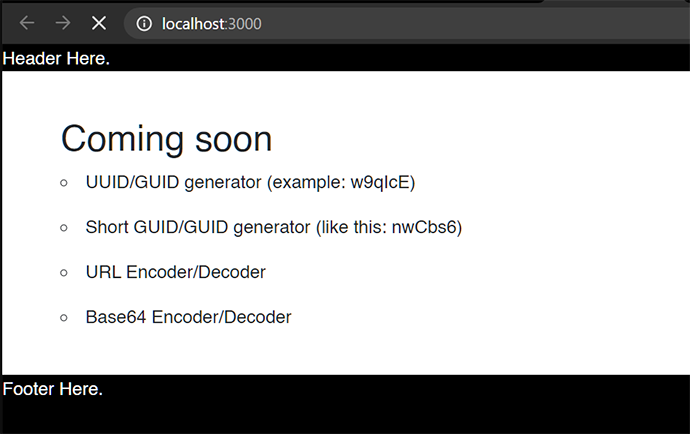

# 100 Days Of Code - [Chinh's Log](https://github.com/chinhdo)

## Day 15: Sun May 23, 2020

**Today's Progress**

About 1/3rd done with adding support for indentation in the textarea input boxes with tab/shift-tab characters. It's harder than it looks.

**Thoughts:**

I am having fun.

**Link to work:**

[Programmer's Toolbox on Azure Static Web Apps](https://programmers-toolbox.chinhdo.com)

---

## Day 14: Sat May 22, 2020

**Today's Progress**

Added react-router-dom to and routing to switch between pages. Tweaked CSS for sidebar/footer. Added Home Page and Encode page with working URL encode/decode.

**Thoughts:**

Need to file my taxes soon.

**Link to work:**

[Programmer's Toolbox on Azure Static Web Apps](https://programmers-toolbox.chinhdo.com)

---

## Day 13: Fri May 21, 2020

**Today's Progress**

It's Friday the 13th day of #100DaysOfCode! 😨 Moved my Programmer's Toolbox #React app to Azure Static Web Apps, with a custom domain. Also blogged about it.

**Thoughts:**

Azure Static Web Apps looks to be a game changer. You are getting important features like SSL, dynamic scaling, global distribution, and GitHub deployment all in one easy-to-use package. Once configured, deploying your changes is as simple as pushing code to your GitHub repository.

**Link to work:**

[Blog post: Deploying Your Web Site to Azure Static Web Apps](https://www.chinhdo.com/20200523/deploying-your-web-site-to-azure-static-web-apps/)
[Programmer's Toolbox on Azure Static Web Apps](https://programmers-toolbox.chinhdo.com)

---

## Day 12: Thu May 20, 2020

**Today's Progress**

Added code to my #reactjs shopping site to connect to Google Firebase NoSql DB, oAuth login with Google. Firebase is very cool.

**Thoughts:**

I feel for the creators of coding courses. Things change so fast their courses are outdated the minute they come out.

**Link to work:**

[GitHub](https://github.com/chinhdo/crwn-clothing)

---

## Day 11: Wed May 19, 2020

**Today's Progress**

Played around with generative CSS art with random border-radius, width/height, opacity, etc.

**Thoughts:**

It's 1 AM now. I am sleepy.

**Link to work:**

[Magenta Dreams](https://codepen.io/chinhdo/pen/oNjmNRP)

---

## Day 10: Tue May 18, 2020

**Today's Progress**

Added header, Login page, a reusable button, and styling to my learning #react Shopping Site app (following Udemy course "Complete React Developer in 2020").

**Thoughts:**

Wow I'm 10% through the challenge already!

**Link to work:**

[Crown Clothing](https://github.com/chinhdo/crwn-clothing)

---

## Day 9: Mon May 17, 2020

**Today's Progress**

Went back and wrote code along with the Udemy course Complete React Developer in 2020 (w/ Redux, Hooks, GraphQL).

**Thoughts:**

I am learning at a consistent pace.

**Link to work:**

[Crown Clothing](https://github.com/chinhdo/crwn-clothing)

---
## Day 8: Sun May 16, 2020

**Today's Progress**

Added TypeScript support to my Programmers Toolbox app, before I write too much JavaScript code.

**Thoughts:**

Upgrading a Create-React-App project to add TypeScript wasn't as bad as I thought. Quick google searches solved most compile issues I ran into. Learned a few things about TypeScript/React in the process.

**Link to work:**

* [Programmer's Toolbox by Chinh Do](https://toolbox.chinhdo.com/)
* [Programmer's Toolbox Github project](https://github.com/chinhdo/programmers-toolbox)

---
## Day 7: Sat May 15, 2020

**Today's Progress**

* Added CSS for responsive menu.

**Thoughts:**

* I am really bad at CSS

**Link to work:**

* [Programmer's Toolbox by Chinh Do](https://toolbox.chinhdo.com/)
* [Programmer's Toolbox Github project](https://github.com/chinhdo/programmers-toolbox)

---
## Day 6: Friday May 14, 2020

**Today's Progress**

Switching gear to get a refresher on some key CSS concepts. Read documentation about and wrote code to experiment with these properties: align-items, display, units.

**Thoughts:**

* Use rem instead of em
* display: flex is the bomb

**Link to work:**

* [Programmer's Toolbox by Chinh Do](https://toolbox.chinhdo.com/)
* [Programmer's Toolbox Github project](https://github.com/chinhdo/programmers-toolbox)

---
## Day 5: Thursday May 14, 2020

**Today's Progress**

* Moved CSS into appropriate component files
* Fixed Bootstrap reference
* Tweaked CSS
* Added Short UUID
* Added road map
* Added Google Analytics
 
**Thoughts:**

I typically would start something, then get distracted with other hobbies or just being lazy browsing Netflix, etc. Participating in the #100DaysOfCode challenge and committing to spending time daily really has helped me keep a consistent schedule and make consistent progress.

**Link to work:**

* [Programmer's Toolbox by Chinh Do](https://toolbox.chinhdo.com/)
* [Programmer's Toolbox Github project](https://github.com/chinhdo/programmers-toolbox)

---
## Day 4: Wednesday May 13, 2020

**Today's Progress**

* CSS tweaks
* About app info in footer
* List of UUIDs

**Thoughts:**

I spent around 2 hours on this today. Learning a few more important React concepts such as function binding, showing a list of items.

**Link to work:**

* [Programmer's Toolbox by Chinh Do](https://toolbox.chinhdo.com/)
* [Programmer's Toolbox Github project](https://github.com/chinhdo/programmers-toolbox)

---
## Day 3: Tuesday May 12, 2020

**Today's Progress**

* HTML/CSS for expandable sidebar with full height.
* Bootstrap
* React components
* UUID generation
* Additional clean-up of code to remove boilerplate stuff.
* Deployed beta version on https://toolbox.chinhdo.com

**Thoughts:**

I've done web development for many years but I either had other "front-end/CSS" developer taking care of CSS things at work, or just googling for how to do various things with CSS and copy ready-made solutions. Today I tried to write CSS from scratch to create a collapsible sidebar and of course I could not do it quickly. Again I googled and after about 20 minutes found a solution that pretty much matched what I am looking for. Can I continue to get by without really knowing CSS? Maybe. But I also want to learn it properly so I fully understand the code.

**Link to work:**

[Programmer's Toolbox Github project](https://github.com/chinhdo/programmers-toolbox)

---
## Day 2: Monday May 11, 2020

**Today's Progress**

Started work on Programmer's Toolbox, a web site with tools/utilities for programmers. The site is done in React - which is pretty much brand new to me. I started a course but did not process too far yet.

* Generated skeleton React site with tooling with [`npx create-react-app`](https://reactjs.org/docs/create-a-new-react-app.html#create-react-app
* Created components for app, header, footer.
* Make some basic CSS adjustments
* Added Bootstrap

**Thoughts:**

I plan to eventually host the site on Azure at https://toolbox.chinhdo.com.

**Link to work:**

[Programmer's Toolbox Github project](https://github.com/chinhdo/programmers-toolbox)

---
## Day 1: Sunday May 10, 2020

**Today's Progress**

* Created from cratch basic Node.js/TypeScript project with Jest, VSCODE debug support.
* Spent countless minutes figuring out some things that should be a lot simpler than they are. Grrr.
* Version 1.0 of the app can now search for tweets, and produce an HTML report with tweets for me to review and like.
* I decided for the bot to recommend tweets instead of liking the tweets itself because:
  * I want to weed out the spam posts.
  * I want to personally view and if appropriate, reply to some of the posts to give encouragement to others also going through the #100DaysOfCode journey.
  * It's also against Twitter TOS to have your bot automatically like tweets - so there's that :)

**Thoughts:**

Took me way more time than I wanted to spend on setting up a basic Node.js/TypeScript project. Still don't have debug support in Visual Studio Code working. Will work on that later. Compared with the .NET ecosystem, I can create a starter .NET console app with all basic tooling support and get up and running in less than 5 minutes.

I ended up spending way more than 1 hour on coding today. I guess I am feeling a little bit of peer pressure - the good kind :)

**Link to work:**

[twitter-bot](https://github.com/chinhdo/twitter-bot)

Generated recommendations: 
